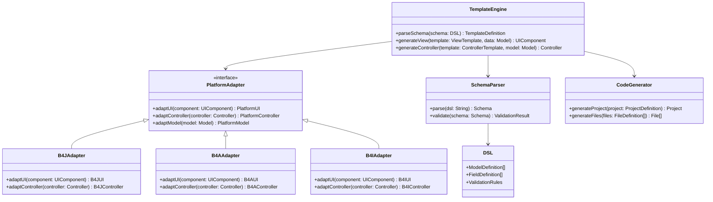

# Arquitectura CRUDTemplate v1.1

## Diagrama de Capas

```
┌─────────────────────────────────────────────────────────────┐
│                    PRESENTATION LAYER                        │
│  ┌─────────────┐ ┌─────────────┐ ┌─────────────┐            │
│  │   B4J UI    │ │   B4A UI    │ │   B4i UI    │            │
│  │  (Desktop)  │ │ (Android)   │ │   (iOS)     │            │
│  └─────────────┘ └─────────────┘ └─────────────┘            │
└─────────────────────────────────────────────────────────────┘
                                │
                                ▼
┌─────────────────────────────────────────────────────────────┐
│                   TEMPLATE ENGINE LAYER                      │
│  ┌─────────────┐ ┌─────────────┐ ┌─────────────┐            │
│  │   Views     │ │ Controllers │ │  Contracts  │            │
│  │   Template  │ │   Template  │ │    API      │            │
│  └─────────────┘ └─────────────┘ └─────────────┘            │
└─────────────────────────────────────────────────────────────┘
                                │
                                ▼
┌─────────────────────────────────────────────────────────────┐
│                   ADAPTER LAYER                              │
│  ┌─────────────┐ ┌─────────────┐ ┌─────────────┐            │
│  │ B4J Adapter │ │ B4A Adapter │ │ B4i Adapter │            │
│  │             │ │             │ │             │            │
│  └─────────────┘ └─────────────┘ └─────────────┘            │
└─────────────────────────────────────────────────────────────┘
                                │
                                ▼
┌─────────────────────────────────────────────────────────────┐
│                     CORE LAYER                               │
│  ┌─────────────┐ ┌─────────────┐ ┌─────────────┐            │
│  │  Template   │ │   Parser    │ │   Schema    │            │
│  │   Engine    │ │     DSL     │ │ Validator   │            │
│  └─────────────┘ └─────────────┘ └─────────────┘            │
└─────────────────────────────────────────────────────────────┘
                                │
                                ▼
┌─────────────────────────────────────────────────────────────┐
│                  GENERATION LAYER                            │
│  ┌─────────────┐ ┌─────────────┐ ┌─────────────┐            │
│  │    Code     │ │    File     │ │   Project   │            │
│  │  Generator  │ │  Generator  │ │  Generator  │            │
│  └─────────────┘ └─────────────┘ └─────────────┘            │
└─────────────────────────────────────────────────────────────┘
                                │
                                ▼
┌─────────────────────────────────────────────────────────────┐
│                     RUNTIME LAYER                            │
│  ┌─────────────┐ ┌─────────────┐ ┌─────────────┐            │
│  │   SQLite    │ │   JRDC2     │ │   Sync      │            │
│  │   Engine    │ │   Client    │ │   Engine    │            │
│  └─────────────┘ └─────────────┘ └─────────────┘            │
└─────────────────────────────────────────────────────────────┘
```

## Diagrama UML de Componentes



## Flujo de Generación

1. **DSL Input**: Usuario define el esquema usando TypeScript/Kotlin DSL
2. **Schema Validation**: Parser valida el esquema DSL
3. **Template Processing**: Engine procesa templates con datos del esquema
4. **Platform Adaptation**: Adaptadores convierten código genérico a específico de plataforma
5. **Code Generation**: Generador crea archivos finales de proyecto
6. **Runtime Integration**: Runtime engine configura SQLite y JRDC2

## Responsabilidades por Capa

### Presentation Layer
- Interfaces de usuario específicas por plataforma
- Manejo de eventos y navegación
- Validación de formularios en cliente

### Template Engine Layer
- Procesamiento de templates
- Generación de componentes UI
- Inyección de datos en templates

### Adapter Layer
- Conversión entre código genérico y específico
- Manejo de diferencias entre plataformas
- Normalización de APIs

### Core Layer
- Parsing del DSL
- Validación de esquemas
- Lógica de negocio común

### Generation Layer
- Generación de archivos de código
- Creación de estructura de proyectos
- Configuración de build

### Runtime Layer
- Conexión a base de datos
- Sincronización de datos
- Manejo de estado de aplicación